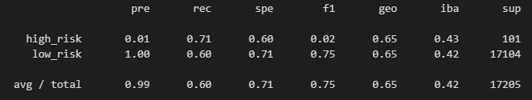
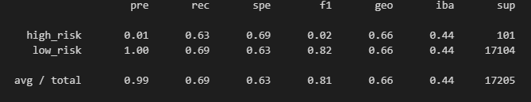
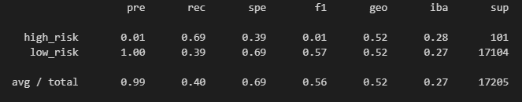
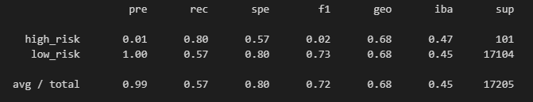
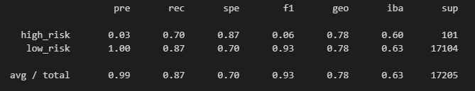
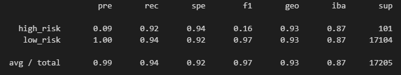

# Credit Risk Analysis

### Goal
____________________

The goal of this project is to find the best Supervised Machine Learning model to assess credit risk using imbalanced-learn and scikit-learn. We used a number of different sampling methods and algorithms including RandomOverSampler, SMOTE, and SMOTEEN to name a few. After testing these models, we used a few reporting techniques to analyze the performance of each model. 

### Results
____________________

##### Random Over Sampling
* Randomly over samples the minority class with replacement.
* Not very accurate for our first model. On to the next.

##### SMOTE (Synthetic Minority Over Sampling Technique)
* Synthesizes new data points from the minority class
* We got a higher recall compared to ROS but our precision was lower. 

##### Cluster Centroid 
* Organizes the data into non-heirarchical clusters
* Our recall was much lower and our accuracy was around the same. Not what we're looking for.

##### SMOTEENN
* Combines over and under-sampling using SMOTE and Edited Nearest Neighbors.
* Average recall, much better accuracy. Let's shoot for higher. 

##### Balanced Random Forests
* We're now onto ensemble classifers. BRF takes two same size bootstrapped sets equal to the size of the minority class. Jointly, they are made up of a set for the minority class and a set for the majority class. 
* This model gave us a balanced accuracy score of around 79%, much better than the others. Our recall was very good and our accuracy was middling compared to the others. 

##### Easy Ensemble AdaBoost 
* AdaBoost is an iterative ensemble method that seeks to boost weak classifiers using an iterative approach, turning them into strong classifiers. 
* This method gave us the highest balanced accuracy score at 93%. We had very strong recall and accuracy. This seems like the right method!

### Conclusion
____________________

There's a clear cut winner out of all the models, and that is the AdaBoost Easy Ensemble method. Our goal was to try and limit the number of loans given to consumers labeled as a credit risk. Since these individuals make up a small number of our data set, it makes it hard not to mis-classify what could've qualified loan candidates. Ensemble methods are powerful because they combine multiple decision trees in different ways to make them into strong predictive models. Where random forests are parallel learners that average out mistakes in parallel, Adaboost is a sequential method that learns from previous mistakes, giving more weight to mislabeled data points. This should be a perfect fit for identifying credit risk in our data set, and our tests support our case. 